# Untitled BOM
|Image|Part Number|Quantity|Description|
|-|-|-|-|
|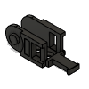|0|50||
||1.75mm Filament Hinge|1||
||10in MIC6 Plate|1||
||2020 Drop-in T-nut, M3|82||
||2020 Drop-in T-nut, M5|68||
|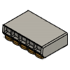|221-415|3||
|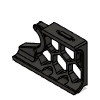|250|7||
|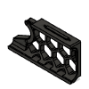|300|7||
|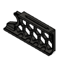|350|7||
||3x6mm Magnet|10||
||4020 Blower Fan|1||
||40x40x10 DC Fan|1||
||4x3mm PTFE Guide Tube|1||
||5x30 Shaft|1||
||5x60 Shaft - With Flat|4||
||6020 Housing|3||
||6020 Impeller|3||
|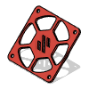|60mm_exhaust_fan_grill|1||
||625 2RS|12||
||8008:5430|1||
||8008:5938|1||
||8008:6210|1||
||8009:2302|1||
||8009:2553|1||
||8009:2706|1||
||8009:461|1||
||90deg Corner|1||
||90deg Corner (OpenBuilds)|3||
||A Belt|1||
||A Drive Frame Lower|1||
||A Drive Frame Upper|1||
||B Belt|1||
||B Drive Frame Lower|1||
||B Drive Frame Upper|1||
||BMG Gear|1||
||BMG Thumb Screw|1||
||BSP Bowden Connector v1|1||
|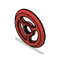|BTT_Knob_Light_Shield|1||
||Base Plate|4||
||Bed heater|1||
||Belt Tensioner|4||
|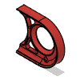|Belt_Guard|4||
||Blower Housing Front|1||
||Blower Housing Rear|1||
||Bowden Tube Holder|1||
||Cable Cover|1||
||Ceramic Cartridge Heater|1||
||Chain Anchor 2 Hole|1||
||Chain Anchor 3 Hole|1||
||Chain Retainer Bracket|1||
||Connector cover|1||
|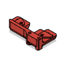|D2F_Endstop_Pod|1||
||DIN Clips|7||
||DIN3 Rail|2||
||Deck Panel|1||
|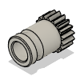|Direct_Drivegear|1||
||Door Handle A|2||
||Door Handle B|2||
||Door Latch|2||
||Dragon Body Front|1||
||Dragon Body Rear|1||
||Dragon Hotend|1||
|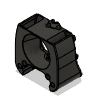|DragonflyBMO_Body_Front|1||
|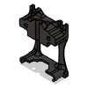|DragonflyBMO_Body_Rear|1||
||DragonflyBMS_Body_Front|1||
|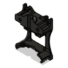|DragonflyBMS_Body_Rear|1||
|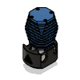|Dragonfly_BMO|1||
||Duet3_Mini5 +expander|1||
||Duet3_Mini_5_+expander|1||
||E3D Revo Micro|1||
||E3D Revo Micro Body Front|1||
||E3D Revo Micro Body Rear|1||
||E3D V6 Body Front|1||
||E3D V6 Body Rear|1||
||EXP MOT Bracket|1||
||Exhaust Grill|1||
||Exhaust Housing|1||
||Exhaust Mount|2||
||Extruder Body|1||
||Extruder Motor Plate|1||
||F695 ZZ|20||
||Fan Grill A|2||
||Fan Grill B|2||
||Fan Grill Retainer|2||
||Filter Element|6||
|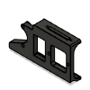|Filtered_Inlet_Skirt|1||
||Flex Sheet|1||
||Foam Tape|2||
||Foam Tape (1mm)|1||
||Foam Tape (3mm)|1||
|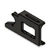|For_1.0mm_Mounting_Tabs|1||
||For_1.2mm_Mounting_Tabs|1||
||Front Door Left|1||
||Front Door Right|1||
||Front Idler A Bottom|1||
||Front Idler A Top|1||
||Front Idler B Bottom|1||
||Front Idler B Top|1||
|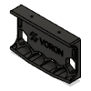|Front_Skirt_Logo|1||
|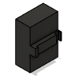|Fuse|1||
||GT2 16T|4||
||GT2 188mm Belt Loop|4||
||GT2 20T 6mm|2||
||GT2 20T 6mm Deflanged|1||
||GT2 20T 9mm|4||
||GT2 20T Idler|6||
||GT2 20T Idler 9mm|4||
||GT2 20T Idler Gates|2||
||GT2 20T Idler Gates 9mm|4||
||GT2 80T Pulley Powge|4||
|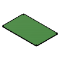|GTR|1||
||GTR Bracket|1||
|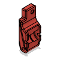|Guidler|1||
|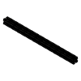|HFSB5-20-330|1||
|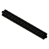|HFSB5-2020-240|1||
||HFSB5-2020-350|2||
|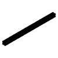|HFSB5-2020-370-TPW|10||
||HFSB5-2020-430-LCP-RCP|4||
||Hall Effect Endstop Pod|1||
||Heat Block|1||
|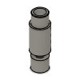|Heatbreak|1||
|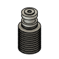|Heatsink|1||
||Hotend Fan Mount|1||
||IEC GS Series Inlet|1||
||IGUS Z chain end|2||
||JST 3pin Recepticle|1||
|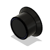|Jog|1||
||K3x5x7 Needlebearing|2||
||KW10 Microswitch|3||
||Keystone Blank|2||
|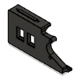|Keystone_Skirt|1||
||Kill Button|1||
||LCD Case Front|1||
||LCD Case Hinge|1||
||LCD Case Rear|1||
||LRS PSU Bracket|2||
|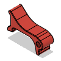|Latch|1||
||Latch Shuttle|1||
||M2.5x10 SHCS|2||
||M2.5x8 SHCS|4||
||M2x10 Self-tapping Screw|16||
||M3 Hammerhead T-Nut|60||
||M3 Hex Nut|6||
||M3 Threaded Insert|110||
||M3 Washer|3||
||M3x10 FHCS|4||
||M3x12 SHCS|41||
||M3x16 SHCS|20||
||M3x20 SHCS|22||
||M3x20 shaft|1||
||M3x30 SHCS|25||
||M3x40 SHCS|30||
||M3x6 BHCS|11||
||M3x6 FHCS|6||
||M3x8 SHCS|166||
||M4 Knurled Nut DIN 466-B|4||
||M4x6 BHCS|7||
||M5 1mm Shim|42||
||M5 Hex Nut|16||
||M5x10 BHCS|34||
||M5x10 BHCS |1||
||M5x16 BHCS|35||
||M5x30 BHCS|22||
||M5x40 SHCS|22||
||MGN12 rail|1||
||MGN9 - 300mm|6||
|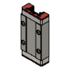|MGN9H|4||
||MGN9H - Carriage|18||
|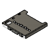|MOLEX_1040310811|1||
|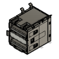|MOLEX_672983090|2||
||MR85 Ballbearing 5x8x2|2||
||Magnet Sheet|1||
||Main Relay Body|1||
||Meanwell LRS-200-24|1||
||Meanwell RS-25|1||
||Mech Z Endstop Assembly|1||
||Middle Fan Support|2||
||Mini12864 Assembly|1||
||Mini12864 Screen|1||
||Mosquito Body Front|1||
||Mosquito Body Rear|1||
||Mosquito Hotend|1||
|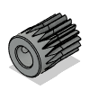|Motorgear_17T_without_setscrew|1||
||NEMA17 Black|2||
||NEMA17 Short-43|2||
||NEMA17 Short-44|1||
||NEMA17 Short-45|1||
||NEMA17 Short-46|1||
||NEMA17 Short-47|1||
||NEMA17 Short-48|1||
||NEMA17 Stepper|4||
|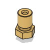|Nozzle|1||
|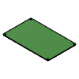|Octopus|1||
||Octopus Bracket|1||
||Omron TL_Q5MC2|1||
|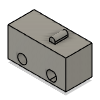|Omron_D2F_F|1||
||PCB|1||
||PCB DIN Clip|1||
||PFTE insert|1||
||PFTE insert (86mm)|1||
|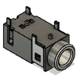|PJ-322|1||
|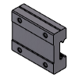|PRODUCT_NAME_1|1||
|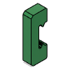|PRODUCT_NAME_2|1||
|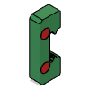|PRODUCT_NAME_3|1||
||PRODUCT_NAME_4|1||
|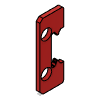|PRODUCT_NAME_5|1||
|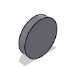|PRODUCT_NAME_6|1||
||PRODUCT_NAME_7|1||
|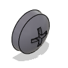|PRODUCT_NAME_8|1||
||PRODUCT_NAME_9|1||
|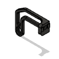|PSU_Stabilizer|1||
|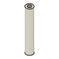|PTFE|3||
||PTFE (41mm)|1||
||PTFE Tube|2||
||Panasonic GX-H15A|1||
|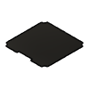|Panel|1||
||Phaetus Dragonfly BMS|1||
||RS-25 PSU Bracket|1||
||Raspberry Pi|1||
|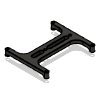|Raspberry_Bracket|1||
||Rear Cover|1||
||Rear Panel|1||
||Rubber Foot|4||
|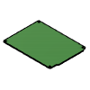|S6|1||
||S6 Bracket|1||
|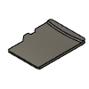|SD|1||
||SKR Bracket|1||
||SKR Pro Bracket|1||
||SKR+EXPMOT|1||
|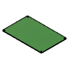|SKR-Pro|1||
|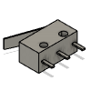|SOLID|4||
||SSR Mount Bracket|1||
||Shaft-assembly|1||
||Side Panel|2||
||Spider|1||
||Spider Bracket|1||
||Spool Holder|1||
||Spring Assembly|1||
||Square Washer, Large|2||
||Square Washer, Small|2||
||Switch|1||
||Tensioner A|1||
||Tensioner B|1||
||Thermal Fuse|1||
||Top Panel|1||
||VHB|12||
||VHB Mount tape|1||
||VORONDESIGN_XY-Endstop|1||
||WAGO_221-415_mount-3x5|1||
||XY Cable Chain Bridge - 2 Hole|1||
||XY Cable Chain Bridge - 3 Hole|1||
||XY Joint - Left|1||
||XY Joint - Right|1||
||Z Bearing Block Bottom|4||
||Z Bearing Block Top|3||
||Z Bearing Block Top HallEffect|1||
||Z Belt|4||
||Z Belt Clamp Lower|4||
||Z Belt Clamp Upper|4||
||Z Belt Cover A|2||
||Z Belt Cover B|2||
||Z Belt Drive A|2||
||Z Belt Drive B|2||
||Z Chain Lower Mount|1||
||Z Idler A|2||
||Z Idler B|2||
||Z Motor Mount|4||
||Z Tensioner 6mm|4||
||Z Tensioner 9mm|4||
||Z_Chain_Guide|1||
||[a]_mini12864_case_front_insert|1||
||bottom_panel_clip_x4|4||
||bottom_panel_hinge_x2|2||
||c-3-1609115-3-a|1||
||chain_retainer_bracket|1||
||corner_clip_4mm|4||
||corner_clip_6mm|8||
||corner_panel_clip_4mm|4||
||door_hinge_x6|6||
||midspan_clip_4mm|4||
||midspan_clip_6mm|8||
||midspan_panel_clip_4mm|3||
||molex_0471510001|1||
||molex_0473460001|1||
||probe_bracket|1||
||probe_bracket_9mm|1||
||raspberry_pi_B_(RJ45)|1||
||te_1-1734248-5|2||
||x_carriage_frame_left|1||
||x_carriage_frame_right|1||
