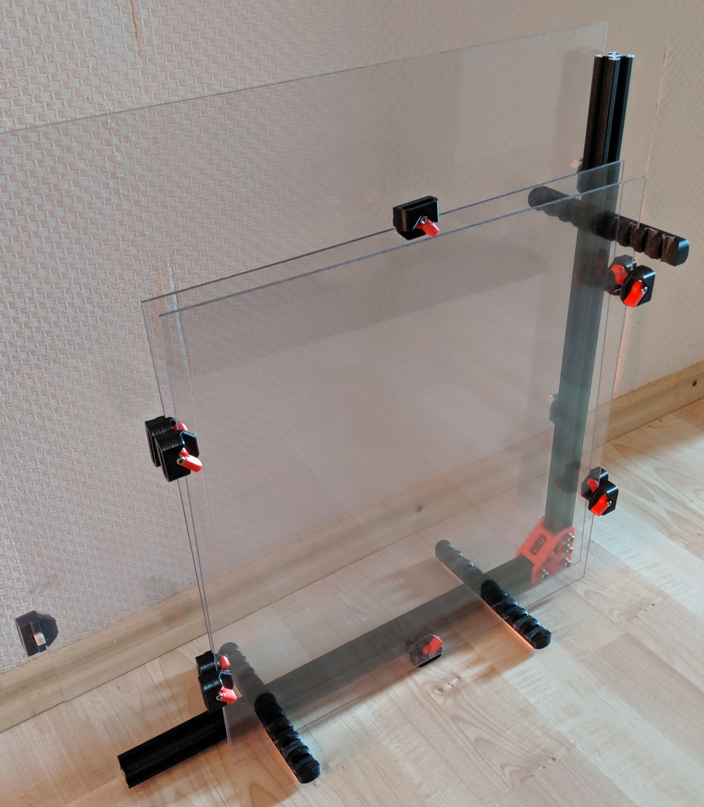

# README

### Overview

Panel Rest for storage of up to 8 side/top panels.

 
 
 Extrusion profile does not matter, if you happen to have some vslot in your basement that is perfectly fine.
 Length is not critical, should be >60% of you panel length for stability.
 
 Use whatever hardware you have lying around to create a 90° angle from the extrusions. OpenBuild Corner cubes work fine, if you're lacking those there are optional support brackets for vslot and 6mm slot profiles in this directory that you can use instead.
 
 Place the weather stripping in the grooves of the _panel_rest part to protect the edges of your panels.
 
 Felt pads goes on the botton of the printed part to protect your floors.

### Parts needed

 * 2x 20x20 aluminium extrusions
 * 11x M5x10 BHCS
 * 11x M3 T-nut
 * 8mm Weather Stripping (slightly larger is fine)
 * Wool Felt Pad to cover the underside of the panel rest
