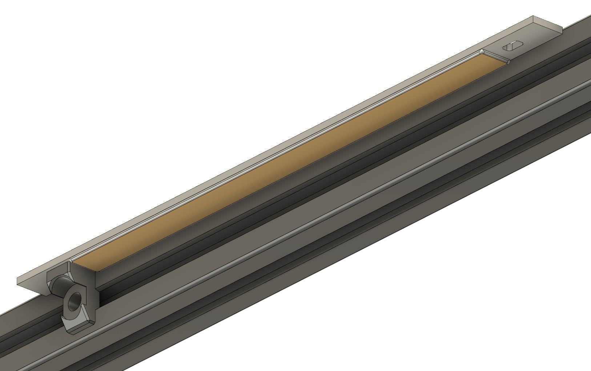
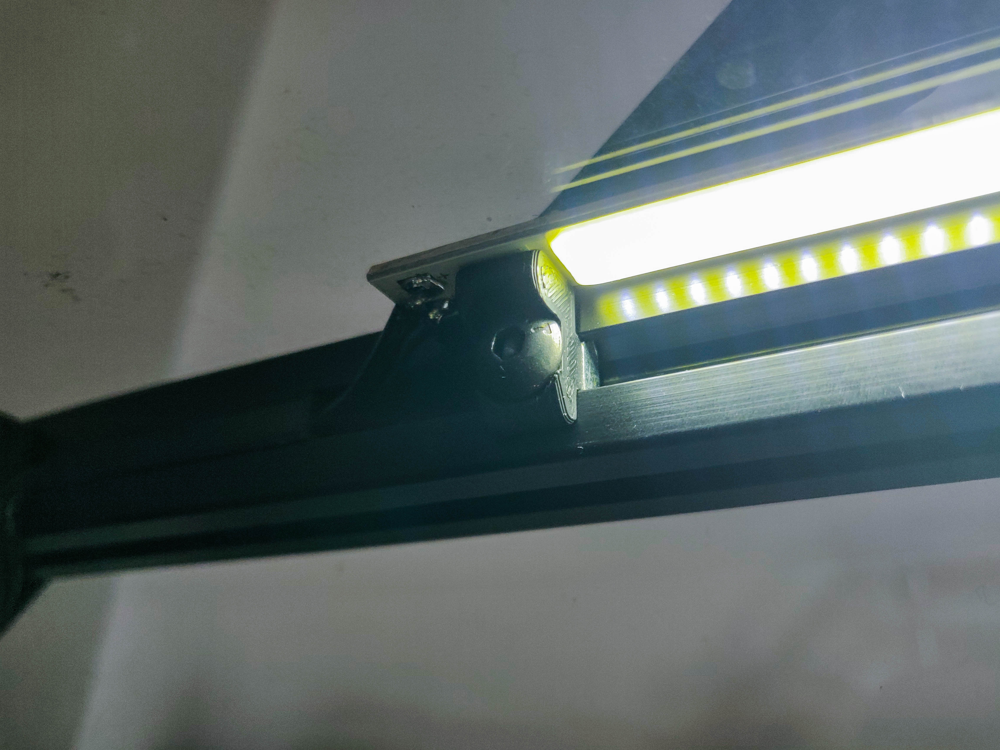

# LED Bar mounts

Designed to mount 12V [LED Bars](https://www.aliexpress.com/item/2pcs-Lot-10W-COB-LED-Strip-Lights-Bulb-Lamp-White-Warm-White-12-14V-1000LM-for/32817091759.html)
to the top frame extrusions. They contain 100 small LEDs so the light is nicely diffused.
The bars are solid aluminum so they spread the heat nicely and are easy to mount.
I highly recommend using some cable covers to hide the cables in the extrusions.

You will need 2 mounts per bar, use M5x8mm screws to mount them to the extrusions as shown in the pictures.

