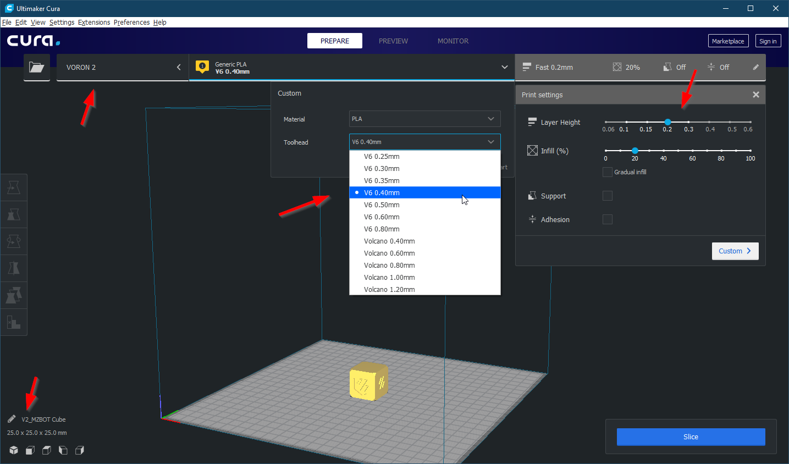

Copy these directories entirely into the Cura profile location for your platform.

* `$CURA_VERSION` is the current version of Cura that is installed.

**Windows**
```
C:\Users\%USERNAME%\AppData\Roaming\cura\$CURA_VERSION\
```

**MacOS**
```
$User/Library/Application\ Support/Cura/$CURA_VERSION/
```

**Linux**
```
$USER/.local/share/cura/$CURA_VERSION/settings/
```


Start Cura, click the `Add printer` button, expand the `Other` category and select `VORON 2`.

Once it is added, go to the Machine Settings and set your build size accordingly. Default size is 250x250x250.