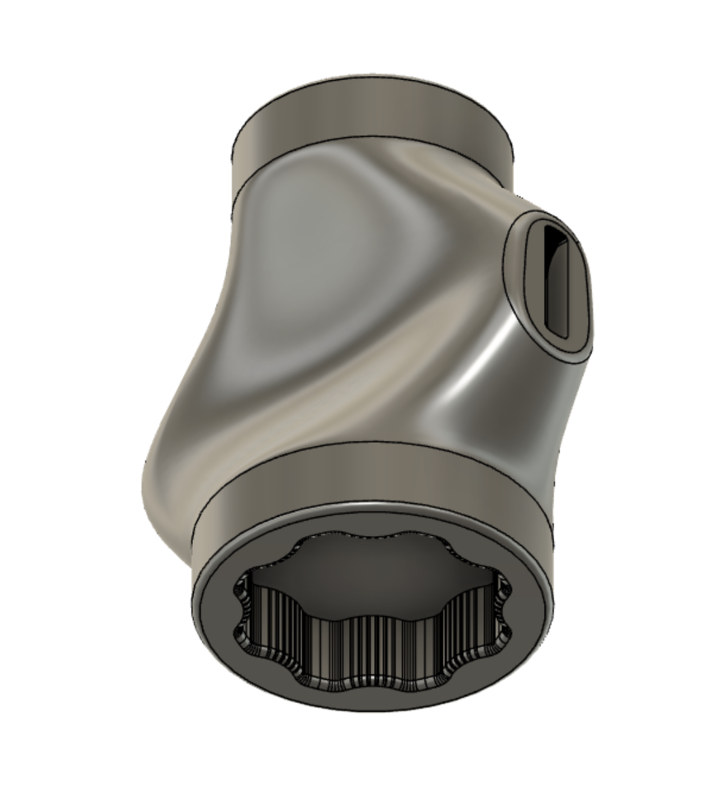

# Wrench for 2.2 Knobs and Panel Clips

### Overview

Two sided wrench for tightening knobs on the Voron 2.2 Z Drive and A/B Drives.
Purpose of this wrench is to assist with gripping the knobs, NOT for over-torquing
them.  Please follow guidelines in manual for proper tightness.
