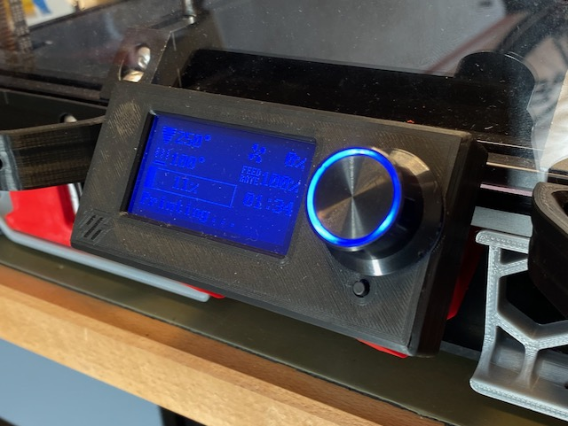

# Fysetc Mini 12864 Display Enclosure



Enclosure for the [Fysetc Mini 12864 Display](https://www.aliexpress.com/item/32862853197.html). The display on the photo is _version B_, that is inverted LCD with Neopixel backlight.

The display is fully supported by klipper, using the configuration below.


```
[display]
# Mini 12864 LCD display
lcd_type: st7567
a0_pin: z:ar16
cs_pin: z:ar17
rs_pin: z:ar23
menu_timeout: 40
encoder_pins: ^z:ar33, ^z:ar31
click_pin: ^!z:ar35
kill_pin: ^!z:ar41
contrast: 63

[neopixel mini12864]
# Display backlight and knob LEDs
pin: z:ar25
chain_count: 3
color_order_GRB: False
initial_RED: 0.4
initial_GREEN: 0.4
initial_BLUE: 0.4
```


The backlight and knob LEDs can be controlled with `SET_LED` command. For example `SET_LED LED=mini12864 INDEX=1 RED=0 GREEN=1 BLUE=0` will set the display backlight to green. Other possible `INDEX` values are 2 and 3 for two LEDs in the knob.

## Assembly

You will need 4 M3 flat head screws, 12 to 16mm long. Socket head screws will work as well, but the screw heads will protrude above the back plate surface and slightly limit the swinging range of the display. 4 spacers go between the back plate and the display PCB.

Please take into consideration that connectors on this display are "upside down". You may need to file down keys on ribbon cable connectors and plug them in the "wrong" way (or re-terminate the cables if you have spare connectors.)